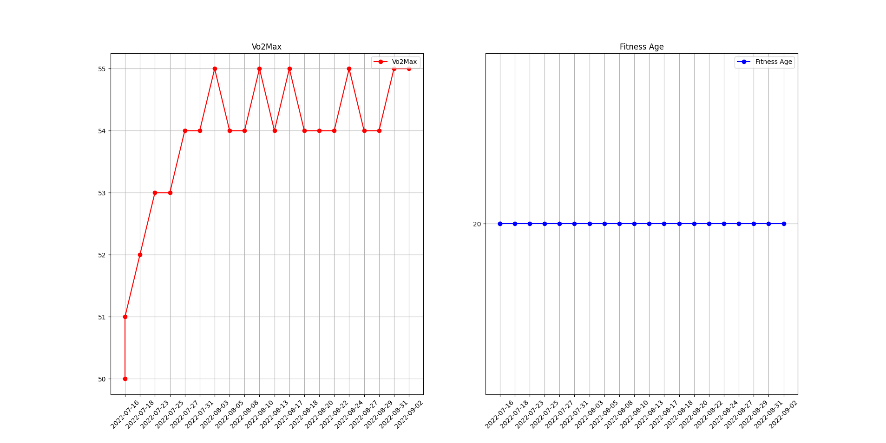
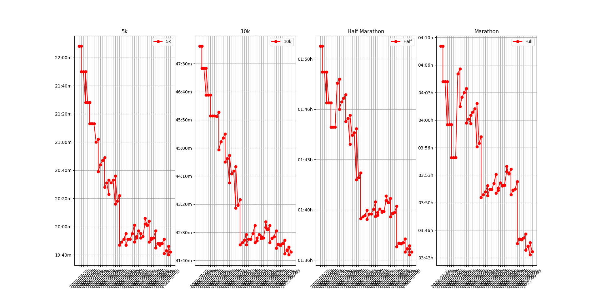

# garmin-metric-visualizer
Shows graphs for the garmin connect metrics (like race predictions and vo2max, fitnessage, ...)

## Usage

### Get Garmin Data

1. See [here](https://support.garmin.com/en-US/?faq=W1TvTPW8JZ6LfJSfK512Q8). Choose `Export All Garmin Data Using Account Management Center`.
2. Copy Files from ZIP in Folder `DI_CONNECT/DI-Connect-Metrics/*`
3. Run the Script

### Run Script

```
pip3 install -r requirements.txt
python3 run.py <garmin-json-data>
```

## Example Images

